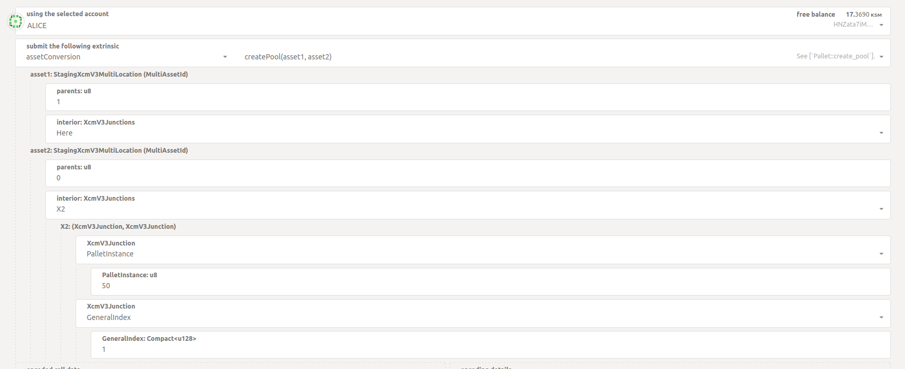
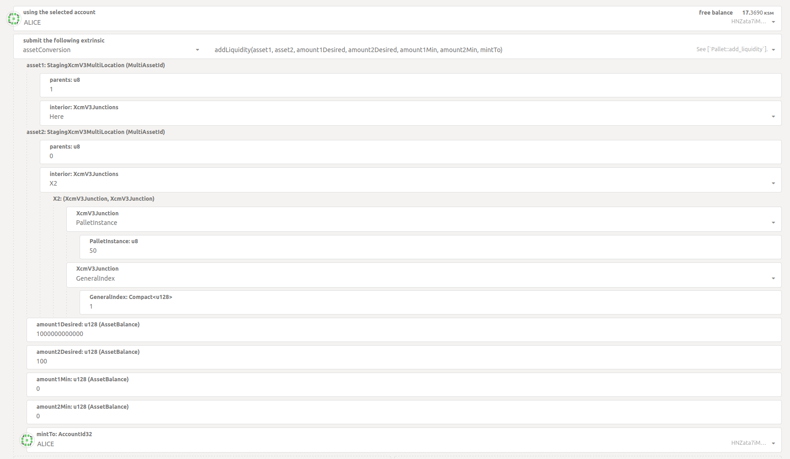

# Asset Hub Kusama Liquidity Pool Example:

## How to construct a transaction using an asset backed by a liquidity pool to pay fees in `txwrapper-core`

## Testnet setup

1) First you need to download the binaries for the [node](https://github.com/paritytech/polkadot-sdk/releases): polkadot, polkadot-parachain, polkadot-prepare-worker and polkadot-execute-worker, and place them in the `zombienet/bin/` directory.
2) You will also need the zombienet executable for your os, which you can download [here](https://github.com/paritytech/zombienet/releases), adn place it in the `zombienet` folder.
3) Run the test network from the root of this project with the command `./zombienet/<your-os-zombienet-executable> -p native spawn ./zombienet/config/medium-network.toml | tee zombienet.log`

## Create a Liquidity Pool

4) Now you need to create the asset in the Asset Hub that we'll use in this example via [`polkadot-js/apss`](https://polkadot.js.org/apps/?rpc=ws://127.0.0.1:9933), with `assetId = 1` and `decimals = 0`, and mint some to `Alice`.
5) Then you can create a Liquidity Pool with that assset and the chain's native asset:



6) After that, you need to add liquidity to the pool to create its LP Tokens:



7) Install dependencies and build the JS target

```bash
# from this repo's root directory run
yarn install && yarn build

# change to the examples directory
cd packages/txwrapper-examples

# build the JS target
# NOTE: This does not need to be run unless you have made changes to the example as the package will already be built via the command that ran from the root directory above.
yarn run build
```

## Run the example

8) Run the example script in the `txwrapper-examples` package (see [txwrapper-core/packages/txwrapper-examples/assetHubKusama/src/assetHubKusama.ts](txwrapper-core/packages/txwrapper-examples/assetHubKusama/src/assetHubKusama.ts)). It will interact with your local node.

From the root of `txwrapper-examples`

```bash
yarn run assetHubKusama
```

## Example Output

```
Alice's SS58-Encoded Address: HNZata7iMYWmk5RvZRTiAsSDhV8366zq2YGb3tLH5Upf74F

Decoded Transaction
To: FoQJpPyadYccjavVdTWxpxU7rUEaYhfLCPwXgkfD6Zat9QP
Amount: 10000000000000

Payload to Sign: 0xa80a03008eaf04151687736326c9fea17e25fc5287613693c912909cb226aa4794f26a480b00a0724e18099502140001000204320504102700000d0000006df8b29b7697be983285bb444581c0275e58f7c3e6bec2b888263e7fd592f095c7be83dc1c4ac006cbe785018c06074a2eb4103871dc5a0c58edb1f83cc02d04

Decoded Transaction
To: FoQJpPyadYccjavVdTWxpxU7rUEaYhfLCPwXgkfD6Zat9QP
Amount: 10000000000000
AssetId: {"parents":0,"interior":{"x2":[{"palletInstance":50},{"generalIndex":1}]}}

Signature: 0x01c0a343ee9dff958691f9149075e8f67b6eb782eceb42d34f2ed3be45c744386ae382db2082b26cd7c18c8628a398044af94f2d9b9d3a55b72cc5cd4eb183ae8c

Transaction to Submit: 0x61028400d43593c715fdd31c61141abd04a99fd6822c8558854ccde39a5684e7a56da27d01c0a343ee9dff958691f9149075e8f67b6eb782eceb42d34f2ed3be45c744386ae382db2082b26cd7c18c8628a398044af94f2d9b9d3a55b72cc5cd4eb183ae8c95021400010002043205040a03008eaf04151687736326c9fea17e25fc5287613693c912909cb226aa4794f26a480b00a0724e1809

Expected Tx Hash: 0x91bda4072c7246fa08675c008abf98c2328805e4f162027e5213a7cd39af60ab
Actual Tx Hash: 0x91bda4072c7246fa08675c008abf98c2328805e4f162027e5213a7cd39af60ab

Decoded Transaction
To: FoQJpPyadYccjavVdTWxpxU7rUEaYhfLCPwXgkfD6Zat9QP
Amount: 10000000000000
```