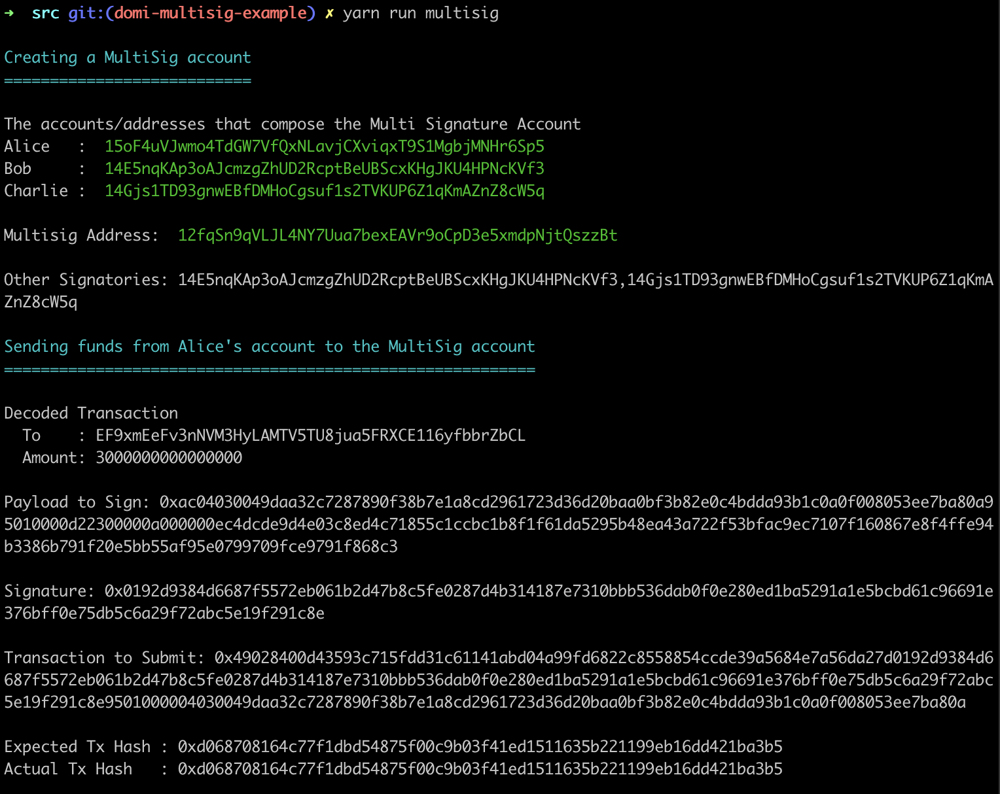
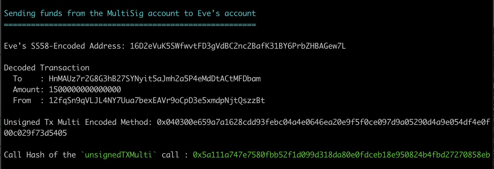
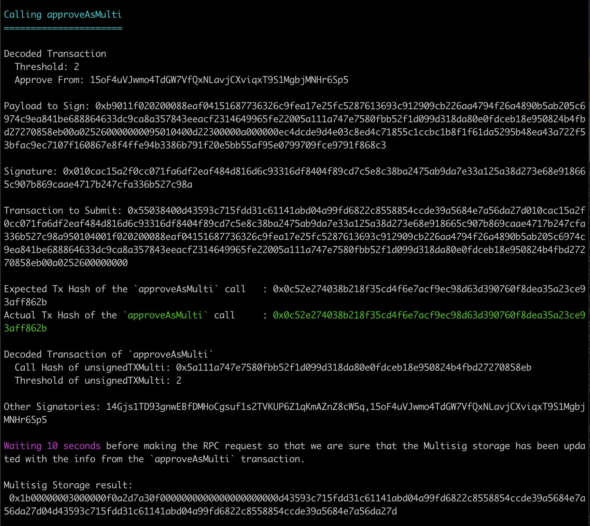
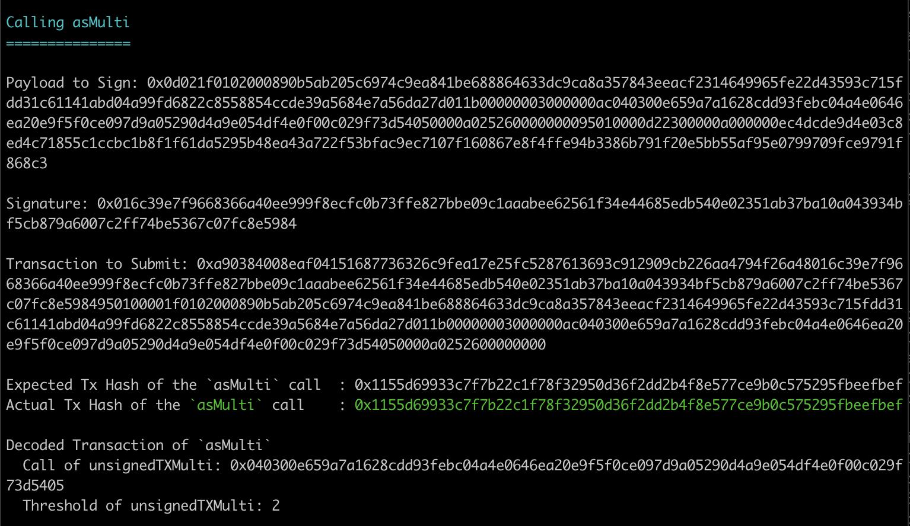
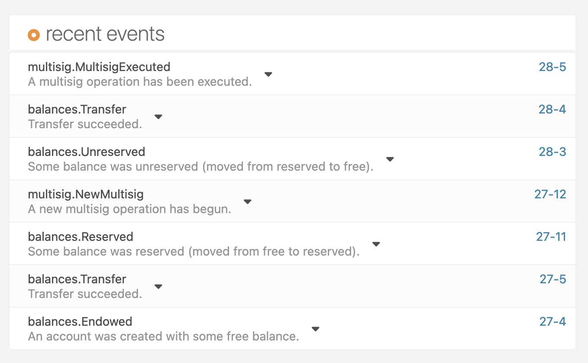

# Multisig example

## Description
The multisig example code shows how to create a Multisig account and execute a transaction from this newly created account to send some funds to another address.

### Steps
More specifically the code implements the following steps :
1. Creates a new Multisig account from the addresses of :
   - Alice
   - Bob 
   - Charlie
2. Sends some initial funds from Alice's account to the Multisig account (in order to be able to execute a transaction from the Multisig account on the next step)
3. Make a transaction from the Multisig account that sends funds from the MultiSig account to Eve's account by implementing 2 types of actions :
   - Approve the call
   - Execute the call

## Setup environment

1) Fetch the latest Substrate or Polkadot/Kusama node from the above link. Follow instructions to build it, and start a dev chain.

    ```bash
    target/release/polkadot --dev
    ```

2) Install dependencies and build the JS target

    ```bash
    # from this repos root directory run
    yarn install && yarn build

    # change to the examples directory
    cd packages/txwrapper-examples

    # build the JS target
    # NOTE: This does not need to be run unless you have made changes to the example as the package will already be built via the command that ran from the root directory above.
    yarn run build
    ```

3) Run the example script (see [src/multisig.ts](src/multisig.ts)). It will interact with your local node.

    ```bash
    yarn run multisig
    ```

## Expected Output in the terminal

Here's a sample output of the above script, using a Polkadot node. Your payload to sign and signature will of course differ from this example.







## Polkadot{.js} apps

We can also check the result in the [explorer](https://polkadot.js.org/apps/?rpc=ws%3A%2F%2F127.0.0.1%3A9944#/explorer) of Polkadot{.js} apps  [menu <em>"Network"</em> > submenu <em>"Explorer"</em>]

### Expected Output in the Polkadot{.js} apps UI



[**OPTIONAL**] We can also create the multisig account through p-js apps to be able to see it in the list of [accounts](https://polkadot.js.org/apps/?rpc=ws%3A%2F%2F127.0.0.1%3A9944#/accounts) (and also see the change in balances) in the UI by following the steps below :
- Polkadot{.js} apps > Accounts Tab > click on Multisig button
- Select the accounts of Alice, Bob And Charlie from the list as the signatories
- Choose a name for your Multisig account, eg. `multi`
- Click the "Create" button
NOTE: The example is working without this step since we are creating the multisig account also from the code.


## Key Takeways from the Multisig example
 
### Call hash vs Call data
- In the `approveAsMulti` we need to pass the **call hash** of the multisig transaction (use of the `construct.txHash` function)
- In the `asMulti` call we pass the **hash of the call data** (use of the `method` function)

### Nonces
The nonce of the `approveAsMulti` and `asMulti` calls depend on the account that is signing the call and it is not attached to the nonce of the multisig account.

That is why we observe the following :
- In the `approveAsMulti` the nonce is set to 1 since it will be signed by Alice (and Alice already submitted a transaction earlier with nonce=0).
- In the `asMulti` the nonce is set to 0 since it will be signed by Bob and Bob has not submitted any other transactions until now.

### `otherSignatories`parameter
In the `approveAsMulti` and `asMulti` calls we need to update the array that we pass in the `otherSignatories` parameter so it excludes the signing account every time. 
1. The `approveAsMulti` call is signed by Alice so the array passed in `otherSignatories` has to exclude Alice's address (`otherSignatoriesSortedExAlice`)
2. Accordingly the `asMulti` call is signed by Bob so the array passed in `otherSignatories` has to exclude Bob's address (`otherSignatoriesSortedExBob`)

### Timepoint of `approveAsMulti` & Storage
- In the `maybeTimepoint` parameter of the `asMulti` call we need to pass the block height and index of the `approveAsMulti` call. In order to to retrieve that dynamically we need to :
  1. Create the Storage key of our Multisig Storage item
  2. Make an RPC request with the `state_getStorage` endpoint (using the Storage key from step 1 to retrieve the Multisig storage data from the chain. This data is retrieved as a SCALE-encoded byte array.
  3. Create the Multisig type by using the result from the RPC call and the registry
  4. Get the `height` and `index` of the timepoint by decoding the retrieved data using the Multisig type

- In order to create the Storage key in step 1 we follow the schema below :
	
      ```bash
      Twox128("Multisig") + Twox128("Multisigs") + Twox64(multisigAddress) + multisigAddress + Blake128(multisigCallHash) + multisigCallHash
      ```

- Before we query the Storage in step 2, we added a delay to ensure that the block in which the extrinsic (of `approveAsMulti`) was included has been already processed and the storage is as expected.

- When we create the Multisig type in step 3, the registry returns the `height` and `index` of the endpoint in the format shown below :

    ```bash
    Type(4) [Map] {
      'when' => Type(2) [Map] {
        'height' => <BN: 14>,
        'index' => <BN: 3>,
    ```

  The returned numbers (`<BN: 14>`, `<BN: 3>`) are instances of the `bn.js` as mentioned in the docs in section [Working with numbers](https://polkadot.js.org/docs/api/start/types.basics/#working-with-numbers). That is why we used the `toNumber()` method to convert them to Javascript numbers and then pass them in the corresponding parameters in the `asMulti` call.

## Questions?

Open up a github issue [here](https://github.com/paritytech/txwrapper-core/issues)
