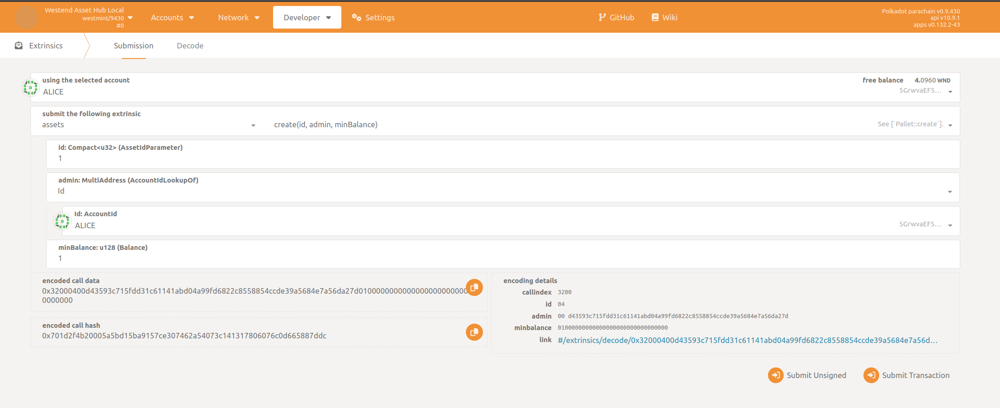
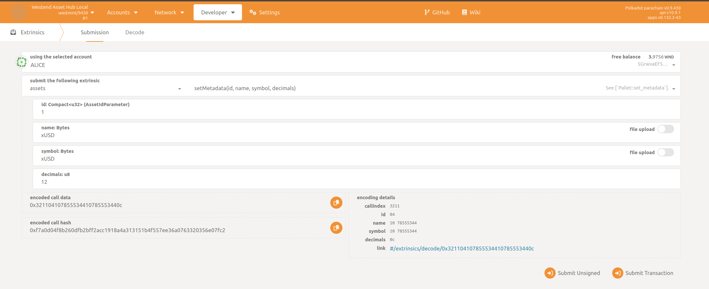
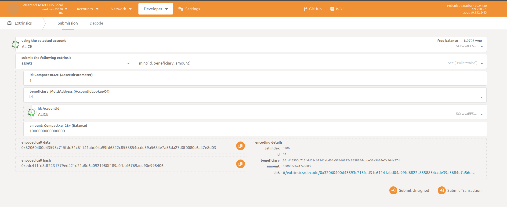
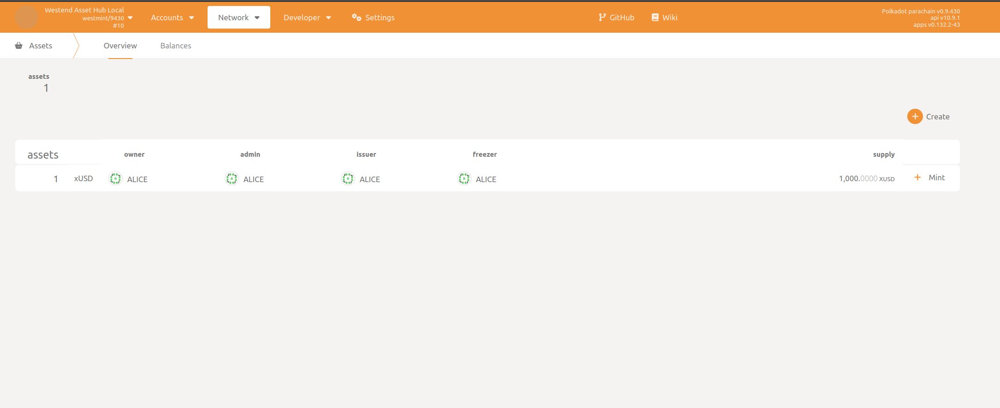
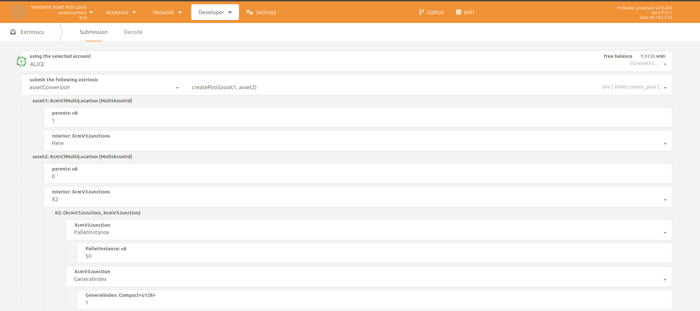
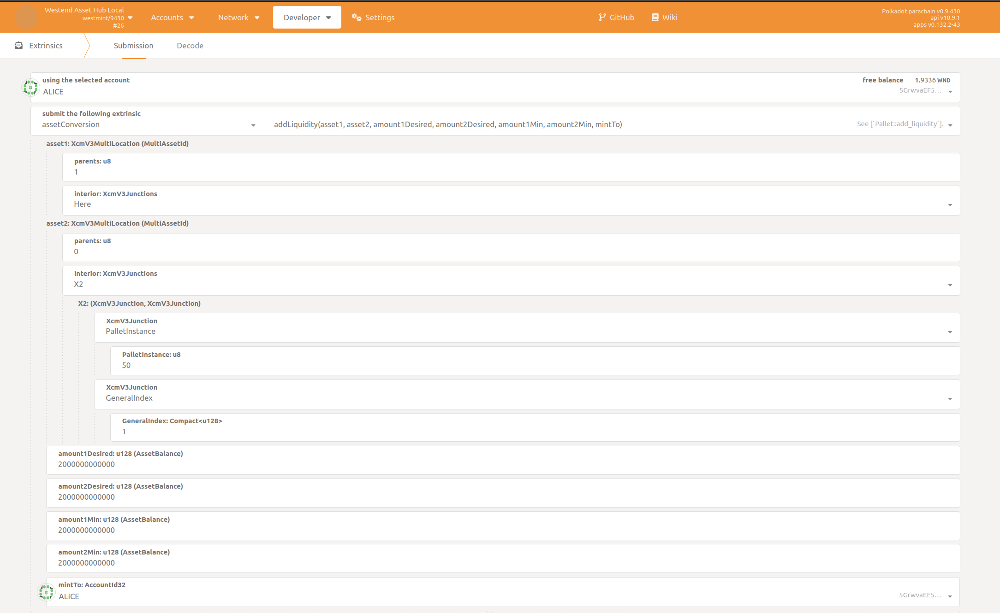
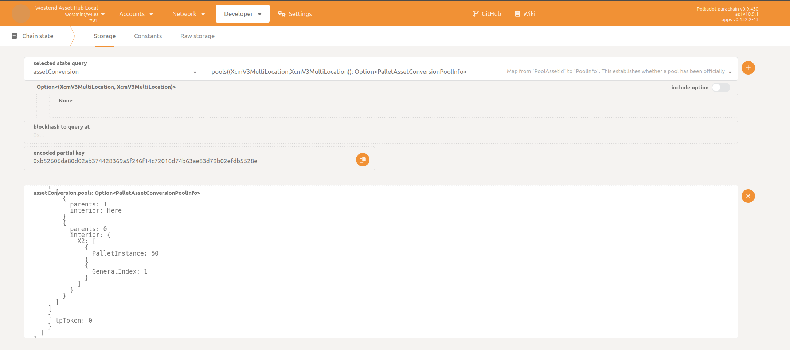

# Example of Paying Fees with Non Native Asset

## Description
Example that shows how to use AssetConversionApi and the pallet-asset-conversion-tx-payment to estimate the fees of a call and to use a sufficient, non native asset to pay for those fees.

## Setting up the enviroment

* In this example we use an `asset-hub-westend-local` chain which requires setting up the relay chain and attaching the corresponding Asset Hub as a parachain. For this purpose, 
zombienet is the preferred choice.

* To run in a dev environment:
	* Clone and build Polkadot with `features=fast-runtime`, in order to decrease the epoch time for development, and copy it into [zombienet](/zombienet/).
	* Download the latest binary for [`polkadot-parachain`](https://github.com/paritytech/cumulus/releases/) into the [zombienet folder](/zombienet/).
	* Setup `zombienet` by downloading your OS's executable from the [latest release](https://github.com/paritytech/zombienet/releases) into the [`./zombienet/`](/zombienet/) directory and editing the [`config.toml`](/zombienet/config.toml) file according to your needs.
    * Then run: 

	* ``` 
		$ ./zombienet/zombienet-linux-x64 -p native spawn ./zombienet/full_network.toml  
		```

## Getting started

* To run the example we just need to complete the Setup stage and run:
* ``` 
	$ yarn run build
	$ yarn run payFeesWithAssetWestend
  ```
## Description

* This example can be divided into two differrent sections: the setup stage and the main stage.

### Setup stage
* The setup stage consists on creating the asset we will be using, for this we use Polkadot-JS:

* * First, we create the asset:


* * Then, we set its metadata and mint some assets:



* * Now that we have our custom asset, we can move onto the next part: the liquidity pool.


* First, we need to create our liquidity pool containing the chain's native asset and our custom asset.


* Then we add liquidity to it.


* Finally, we can check our pool was correctly created, with our liquidity pool token being `0`.


### Main stage

* Thanks to the [pallet-asset-conversion-tx-payment](https://github.com/paritytech/substrate/tree/master/frame/transaction-payment/asset-conversion-tx-payment) and it's [signed extension](https://github.com/paritytech/cumulus/blob/32169649b4a651437702859d89bc0f6096fb1a8b/parachains/runtimes/assets/asset-hub-westend/src/lib.rs#L827) we can use any arbitrary asset as long as it has a liquidiy pool against the chain's native asset.

* Now it's time for the main stage of our example, the payment itself. For this example, and as a way to simulate the use of an offline environment, we use txwrapper-polkadot to create the transactions and we use RPC calls to send them to the node. But first, we use Polkadot-JS to estimate the fees for our call, in this case, a simple native asset transfer. It's important to be aware that this fee is just an  estimation and may differ from the actual fees.

* Then we create the transfer call using txwrapper and send it the node using the RPC `author_submitExtrinsic` and the signed tx we built with txwrapper.

* Finally, we listen the events for the `AssetTxFeePaid` event to know our operation was successful.

